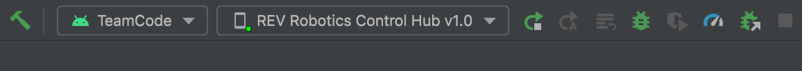

<h1 style="text-align: center">Teamcode 2023</h1>
<p style="text-align: center">Codebase for FTC game season 2023-24, CENTERSTAGE</p>

## Setting up the Development Environment

### Downloading FtcRobotController and Team Code

Run the following command in the terminal at the location you wish to store the project.  
This will download [FtcRobotController](https://github.com/FIRST-Tech-Challenge/FtcRobotController), the library for
FTC, and [our team code](https://github.com/Big-Green-7245/teamcode2023).

```bash
/bin/bash -c "$(curl -fsSL https://raw.githubusercontent.com/Big-Green-7245/teamcode2023/main/.assets/setupRepo.sh)"
```

Then, open the project you just downloaded (called FtcRobotController) in Android Studio or Intellij.  
These two IDEs (Android Studio & Intellij) are essentially the same, and you should use Android Studio unless you know
what you're doing.

Now, you are ready to edit the Team Code will be located in `/TeamCode/src/main/java/org/firstinspires/ftc/teamcode`!

---

## Introduction to the Code

The main programs which the robot can execute are stored in the base `teamcode` folder.  
Each feature/component on the robot is implemented in its own class in the `modules` folder.  
The `state` folder offers a library to create a state machine, which is very useful in automating robots.  
The `util` folder contains miscellaneous classes that help us interact with the robot and things like telemetry.

## Uploading the code to the robot

To upload code to the robot, connect to the Control Hub via USB or WiFi-Direct.

*If connected wirelessly, you need to run this command after connecting.*

```bash
adb connect 192.168.43.1:5555
```

Once connected, it should look like this:


Click the run (or rerun) button to upload the code.

### Making sure the code updates

Every TeleOp/Autonomous program should have a programVer variable to keep track of version increments. Sometimes Android
Studio does not update the code right away.

```java
final String programVer="1.0";
```

---

## Trouble Shooting / Misc

### Sdk Not Found

If you get an error saying that the Android Sdk is not found, try adding `local.properties` in your
project root directory with the following line

```properties
sdk.dir=/Users/yourusernamehere/Library/Android/sdk
```

or pointing to wherever your Android Sdk is located.

### Using Java 17+ 😎

To use Java 17, two files need to be edited: `build.common.gradle` and `/FtcRobotController/build.gradle`.

Locate

```groovy
compileOptions {
    sourceCompatibility JavaVersion.VERSION_1_8
    targetCompatibility JavaVersion.VERSION_1_8
}
```

in both files and replace `VERSION_1_7` or `VERSON_1_8` with `VERSION_17`. Then resync gradle through a button that
should appear towards the top right or through the gradle menu on the right (Gradle -> Reload All Gradle Projects).

---

## For Maintainers

Greetings, future captains, here are the steps you need to do to get ready for a new season.

1. Create a new Repo and Team in the GitHub Organization
2. Add the Repo to the Team and give everyone Maintainer access
3. Update the season and repo names in this `README.md`
4. Edit the repository links in this `README.md` to the new Repo
5. Edit the repository links in `/.assets/setupRepo.sh` to the new Repo